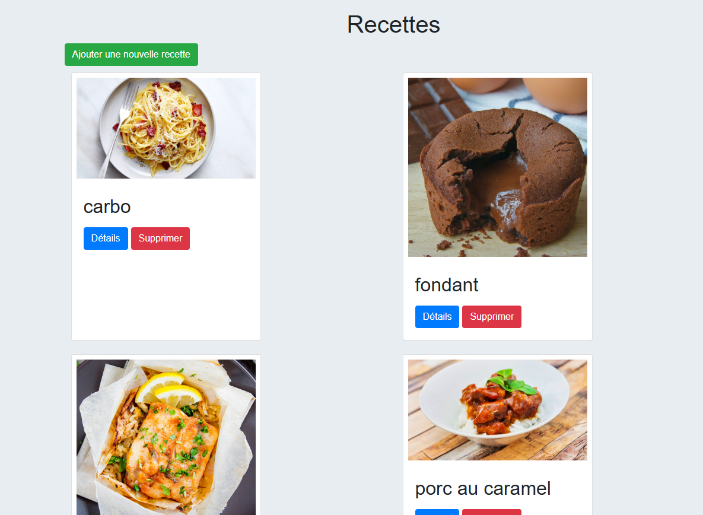
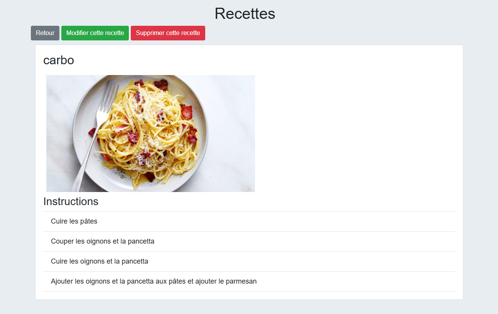

# Recettes de cuisine

Ce projet propose de gérer des recettes de cuisine.
Réalisé avec Symfony.

## Pré-requis
php 8.4.5
symfony 5.11.0
composer 2.8.6

run composer install pour installer les dépendances

## Run
command : symfony server:start
server available on : http://localhost:8000/

## Sources
https://github.com/Bmartin35000/sandboxSymfony

uploading images
https://symfonycasts.com/screencast/symfony-uploads/upload-in-form

Handling many to one relation in a form
https://symfony.com/doc/current/form/form_collections.html